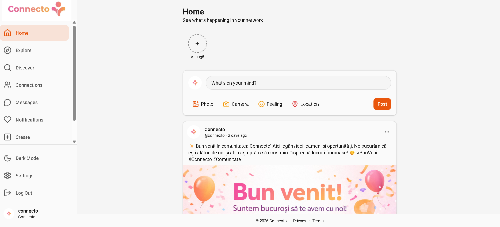

# Connecto - Social Media Platform 🎉

<p align="center">
  
</p>

<p align="center">
  A modern social media platform built with React, TypeScript, and Supabase 🚀
</p>

<p align="center">
  <a href="https://connecto-one.vercel.app/" target="_blank">
    
  </a>
</p>

## Screenshots

<p align="center">
  
  
</p>

<p align="center">
  <a href="#features">Features</a> •
  <a href="#tech-stack">Tech Stack</a> •
  <a href="#getting-started">Getting Started</a> •
  <a href="#project-structure">Project Structure</a> •
  <a href="#environment-variables">Environment Variables</a> •
  <a href="#license">License</a>
</p>

---

## Features ✨

### Core Features ✨
- **User Authentication** 🔐 - Secure sign up/sign in with email and password
- **Posts** 📝 - Create, view, like, and comment on posts
- **Stories** 📸 - Share temporary content that expires after 24 hours
- **Comments** 💬 - Interactive comment system on posts
- **Connections** 🤝 - Send and manage connection requests
- **Follow System** 👥 - Follow other users to see their content
- **Messages** 💭 - Real-time private messaging between users
- **Notifications** 🔔 - Stay updated with notifications for various activities
- **User Profiles** 👤 - Customizable profiles with bio, avatar, and cover image
- **Discover/Explore** 🔍 - Discover new content and users
- **Dark/Light Theme** 🌙 - System-wide theme switching

### Additional Features 💡
- **Image Upload** 🖼️ - Upload images for posts and profiles
- **Video Upload** 🎥 - Upload videos for stories and posts
- **Post Insights** 📊 - View engagement metrics on your posts
- **Suggested Users** 🎯 - Get recommendations for users to follow
- **Online Status** 🟢 - See when users are online or last active
- **Real-time Updates** ⚡ - Live updates for likes, comments, and posts
- **Account Deletion** 🗑️ - Delete your account and data permanently
- **Privacy Policy** 📜 - Comprehensive privacy policy page
- **Terms of Service** 📋 - Terms and conditions page

---

## Tech Stack 🛠️

### Frontend 🎨
- **React 18** ⚛️ - UI library
- **TypeScript** 📘 - Type-safe JavaScript
- **Vite** ⚡ - Build tool and dev server
- **Tailwind CSS** 💨 - Utility-first CSS framework
- **Shadcn/UI** 🎭 - Component library
- **React Router** 🛤️ - Client-side routing
- **Supabase Client** ☁️ - Backend integration

### Backend (Supabase) ☁️
- **PostgreSQL** 🐘 - Relational database
- **Authentication** 🔐 - User management
- **Storage** 📦 - File storage for images/videos
- **Realtime** 📡 - Real-time subscriptions
- **Edge Functions** ⚡ - Serverless functions

### Development Tools 🔧
- **ESLint** 🔍 - Code linting
- **Vitest** 🧪 - Testing framework
- **Bun** 🐰 - JavaScript runtime and package manager

---

## Getting Started 🏁

### Prerequisites 📋

- **Node.js** 18+ 🟢
- **Bun** 🐰 (recommended) or npm/yarn 📦
- **Supabase Account** ☁️ - [Create one here](https://supabase.com)

### Installation 📦

1. **Clone the repository** 📂
   ```bash
   git clone <repository-url>
   cd Connecto
   ```

2. **Install dependencies** 📥
   ```bash
   # Using bun (recommended)
   bun install
   
   # Or using npm
   npm install
   ```

3. **Set up Supabase** 🔧

   a. Create a new Supabase project at [supabase.com](https://supabase.com)
   
   b. Run the migrations in `supabase/migrations/`:
      - `20260213165028_e62793d5-3a85-4007-aaf2-1c00786516a8.sql`
      - `20260215164637_f1fe321b-40be-4525-995f-f720d815633a.sql`
      - `20260216181409_f2603ac3-5bd1-41d5-93e8-3f79b2947bdb.sql`
      - `20260221100451_7332021c-64d6-475d-a30e-ae91ea2b38a3.sql`
   
   c. Configure storage bucket for media uploads
   
   d. Set up authentication settings

4. **Configure Environment Variables** ⚙️

   Create a `.env` file in the root directory:
   ```env
   VITE_SUPABASE_URL=your_supabase_url
   VITE_SUPABASE_ANON_KEY=your_supabase_anon_key
   ```

5. **Start the development server** 🚂
   ```bash
   # Using bun
   bun dev
   
   # Or using npm
   npm run dev
   ```

6. **Open your browser** 🌐
   Navigate to `http://localhost:5173`

---

## Project Structure 📁

```
Connecto/
├── public/                    # Static assets
│   ├── favicon.ico           # Site favicon
│   ├── placeholder.svg       # Placeholder images
│   └── robots.txt           # SEO robots file
├── src/
│   ├── assets/               # Application assets
│   │   ├── connecto-icon.png
│   │   ├── connecto-logo.png
│   │   └── login.avif
│   ├── components/          # React components
│   │   ├── auth/            # Authentication components
│   │   │   └── ProtectedRoute.tsx
│   │   ├── layout/          # Layout components
│   │   │   ├── EmailVerificationBanner.tsx
│   │   │   ├── Layout.tsx
│   │   │   ├── MobileNav.tsx
│   │   │   └── Sidebar.tsx
│   │   ├── posts/           # Post-related components
│   │   │   ├── CommentsSection.tsx
│   │   │   ├── PostCard.tsx
│   │   │   ├── PostComposer.tsx
│   │   │   └── PostInsights.tsx
│   │   ├── stories/         # Story components
│   │   │   ├── Stories.tsx
│   │   │   └── StoryViewer.tsx
│   │   ├── ui/              # UI components (Shad │   │  cn)
│   ├── button.tsx
│   │   │   ├── card.tsx
│   │   │   ├── dialog.tsx
│   │   │   ├── input.tsx
│   │   │   └── ... (many more)
│   │   └── users/           # User-related components
│   │       └── SuggestedUsers.tsx
│   ├── contexts/            # React contexts
│   │   ├── AuthContext.tsx  # Authentication context
│   │   └── ThemeContext.tsx # Theme context
│   ├── hooks/               # Custom React hooks
│   │   ├── useComments.ts
│   │   ├── useConnections.ts
│   │   ├── useFollows.ts
│   │   ├── useMessages.ts
│   │   ├── useNotifications.ts
│   │   ├── usePosts.ts
│   │   ├── useProfile.ts
│   │   ├── useStories.ts
│   │   └── useSuggestedUsers.ts
│   ├── integrations/        # External integrations
│   │   └── supabase/
│   │       ├── client.ts    # Supabase client setup
│   │       └── types.ts     # TypeScript types
│   ├── lib/                 # Utility libraries
│   │   └── utils.ts         # Helper functions
│   ├── pages/               # Page components
│   │   ├── Auth.tsx         # Authentication page
│   │   ├── Chat.tsx         # Chat page
│   │   ├── Connections.tsx  # Connections page
│   │   ├── Create.tsx       # Create post/story page
│   │   ├── Discover.tsx     # Discover page
│   │   ├── Explore.tsx      # Explore page
│   │   ├── Index.tsx        # Home/Feed page
│   │   ├── Messages.tsx     # Messages page
│   │   ├── Notifications.tsx# Notifications page
│   │   ├── Profile.tsx      # User profile page
│   │   ├── Settings.tsx     # Settings page
│   │   ├── UserProfile.tsx  # Other user profile
│   │   └── NotFound.tsx     # 404 page
│   ├── test/                # Test files
│   ├── App.css              # App styles
│   ├── App.tsx              # Main App component
│   ├── index.css            # Global styles
│   └── main.tsx             # Entry point
├── supabase/                # Supabase configuration
│   ├── config.toml          # Supabase config
│   ├── functions/           # Edge functions
│   │   ├── delete-account/
│   │   │   └── index.ts     # Delete account function
│   │   └── signup/
│   │       └── index.ts     # Custom signup function
│   └── migrations/          # Database migrations
│       ├── 20260213165028_e62793d5-3a85-4007-aaf2-1c00786516a8.sql
│       ├── 20260215164637_f1fe321b-40be-4525-995f-f720d815633a.sql
│       ├── 20260216181409_f2603ac3-5bd1-41d5-93e8-3f79b2947bdb.sql
│       ├── 20260221100451_7332021c-64d6-475d-a30e-ae91ea2b38a3.sql
│       ├── 20260301132000_add_last_seen_at.sql
│       └── 20260301134000_enable_realtime.sql
├── components.json          # Shadcn components config
├── eslint.config.js         # ESLint configuration
├── index.html               # HTML entry point
├── package.json             # Dependencies
├── postcss.config.js        # PostCSS config
├── tailwind.config.ts       # Tailwind config
├── tsconfig.json            # TypeScript config
├── tsconfig.app.json        # TypeScript app config
├── tsconfig.node.json       # TypeScript node config
├── vite.config.ts           # Vite config
├── vitest.config.ts         # Vitest config
└── .env                     # Environment variables (not committed)
```

---

## Environment Variables 🌍

| Variable | Description | Required |
|----------|-------------|----------|
| `VITE_SUPABASE_URL` | Your Supabase project URL | Yes |
| `VITE_SUPABASE_ANON_KEY` | Your Supabase anon key | Yes |

### Getting Supabase Credentials 🔑

1. Go to [Supabase Dashboard](https://supabase.com/dashboard)
2. Select your project
3. Go to **Settings** → **API**
4. Copy the **Project URL** and **anon public** key

---

## Available Scripts 📜

```bash
# Development
bun dev          # Start development server
bun build        # Build for production
bun preview      # Preview production build

# Testing
bun test         # Run tests
bun test:watch   # Run tests in watch mode

# Linting
bun lint         # Run ESLint

# Type checking
bun typecheck    # Run TypeScript type checking
```

---

## Database Schema 🗄️

The application uses the following main tables:

- **users** 👤 - User profiles and information
- **profiles** 👤 - Extended profile information with last_seen_at
- **posts** 📄 - User posts with text, images, videos
- **comments** 💬 - Comments on posts
- **likes** ❤️ - Post likes (real-time enabled)
- **stories** ⏰ - Temporary stories (24h expiry)
- **follows** 👥 - Follow relationships
- **connections** 🤝 - Connection requests and status
- **messages** ✉️ - Private messages
- **notifications** 🔔 - User notifications
- **saved_posts** 📑 - Saved posts (real-time enabled)
- **story_views** 👁️ - Story view tracking

---

## Contributing 🤝

Contributions are welcome! Please read our [Contributing Guidelines](CONTRIBUTING.md) before submitting pull requests.

---

## Code of Conduct 📖

Please read our [Code of Conduct](CODE_OF_CONDUCT.md) to keep our community approachable and respectable.

---

## Security 🔒

For security vulnerabilities, please read our [Security Policy](SECURITY.md).

---

## License 📄

This project is licensed under the MIT License - see the [LICENSE](LICENSE) file for details.

---

## Acknowledgments 🙏

- [Shadcn](https://ui.shadcn.com/) for the UI components
- [Supabase](https://supabase.com/) for the backend infrastructure
- [Tailwind CSS](https://tailwindcss.com/) for styling
- [React](https://react.dev/) community

---

<p align="center">Made with ❤️ by Connecto Team</p>
